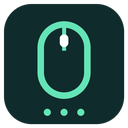

> This is inherited upstream documentation. For this independent fork, its changes, artwork, and release status, see [the fork README](../README.md).

> [!WARNING]
> **OpenLogi est en cours de développement actif** et n'est pas encore stable — les fonctionnalités et la configuration peuvent encore changer. Mettez une **Star** ⭐ au dépôt et **suivez-le** 👀 pour être averti dès qu'une nouvelle version est publiée.

<h4 align="right"><a href="../README.md">English</a> | <a href="README.zh-CN.md">简体中文</a> | <a href="README.ja.md">日本語</a> | <a href="README.de.md">Deutsch</a> | <strong>Français</strong> | <a href="README.ko.md">한국어</a></h4>

<p align="center">
    
</p>

<h1 align="center">OpenLogi</h1>
<p align="center"><strong>⚡️ Une alternative native et local-first à Logitech Options+, écrite en Rust 🦀<br/>Libérez tout le potentiel des souris, claviers et webcams Logitech via HID++ et UVC</strong></p>


<div align="center">
    <a href="https://twitter.com/AprilNEA" target="_blank">
    </a>
    <a href="https://t.me/+VDtkR5OSAT04NzVh" target="_blank">
    </a>
    <a href="https://github.com/AprilNEA/OpenLogi/releases" target="_blank">
    </a>
    <a href="https://github.com/AprilNEA/OpenLogi/commits" target="_blank">
    </a>
    
</div>

<p align="center">
    <a href="https://trendshift.io/repositories/42303" target="_blank">
    </a>
</p>

> **Assez d'Options+ ? Essayez OpenLogi.**

Fonctionne sous macOS, Linux et Windows.

---

## Au-delà d'Options+

Ce qu'OpenLogi fait et qu'Options+ ne fait pas :

- **Rester léger.** Du Rust natif + GPUI.
- **Tourner sous Linux.** Linux est une plateforme de premier rang pour OpenLogi.
- **Choisir son bouton de gestes.** Confiez le rôle de gestes à n'importe quel bouton physique — ou désactivez complètement les gestes.
- **Une configuration en texte brut.** Tout tient dans un fichier TOML, synchronisable entre machines comme vous voulez.
- **Scriptable.** Une vraie CLI en plus de la GUI.

## Fonctionnalités

- Appareils connectés via récepteurs Logi Bolt, récepteurs Unifying, Bluetooth ou câble, avec pourcentage de batterie et état de charge
- Remappage des boutons via le hook d'entrée de l'OS : catalogue d'actions intégrées plus raccourcis clavier personnalisés (rédigés en TOML)¹
- Surcouches de profil par application avec bascule automatique au focus (macOS + Windows ; Linux uniquement en X11 / XWayland)
- Lampes Litra : alimentation, luminosité et température de couleur, avec allumage automatique optionnel suivant l'activité de la caméra

**Souris**

- Capture et remappage des boutons du milieu, mode-shift et molette de pouce (le bouton du milieu partout, le reste selon l'appareil)
- Affectations de gestes par direction avec capture en direct, sur n'importe quel bouton compatible
- Actions Ring : un anneau d'actions à huit emplacements centré sur le curseur (`ShowActionsRing`), avec des dispositions par application
- Contrôle DPI avec préréglages et actions Cycle / Set-preset (`0x2201`)
- Molette SmartShift : mode, sensibilité et panneau de cran permanent (`0x2111`)
- Inversion native du défilement par appareil (`0x2121`, appareils compatibles)

**Clavier**

- Remappage global des touches F : le même catalogue d'actions que la souris, plus des actions avancées — saisie de texte, combinaisons de touches, workflows multi-étapes (macOS + Windows)
- Éclairage RGB statique (`0x8070` / `0x8080`, appareils compatibles)

**Caméra**

- N'importe quelle webcam UVC Logitech (Brio, StreamCam, série C920, …), prête à l'emploi
- Aperçu en direct qui n'allume la caméra que pendant que vous la regardez — la quitter la libère entièrement et la LED s'éteint
- Réglages d'image écrits directement dans le matériel UVC — zoom, mise au point, exposition, luminosité, contraste, saturation, netteté, balance des blancs, teinte, avec bascules automatiques pour mise au point / exposition / balance des blancs — appliqués dans Meet / Zoom / OBS et toute autre application utilisant la caméra
- Profils en un clic : Par défaut / Streaming / Appel vidéo intégrés, plus des instantanés personnalisés ; les réglages persistent par caméra et sont réécrits dans le matériel au prochain affichage

¹ Sous Linux, les actions de touches multimédia passent par D-Bus MPRIS ; quelques actions propres à macOS n'ont pas d'équivalent Linux universel et sont sans effet. Windows associe les actions de plateforme à leurs équivalents natifs lorsqu'ils existent.

## Installation

> [!IMPORTANT]
> Quittez d'abord **Logi Options+** — les deux applications se disputent l'accès HID++ et un récepteur ne peut appartenir qu'à une seule à la fois.

### macOS

Nécessite macOS 13 ou une version ultérieure.

Téléchargez le `.dmg` signé et notarié depuis la [dernière release](https://github.com/AprilNEA/OpenLogi/releases/latest) et glissez `OpenLogi.app` dans `/Applications`.

Ou installez via [Homebrew](https://brew.sh) :

```sh
brew install --cask openlogi
```

Le cask Homebrew officiel est la voie d'installation par défaut. Pour suivre explicitement la dernière release GitHub via `aprilnea/tap` :

```sh
brew tap aprilnea/tap
brew install --cask aprilnea/tap/openlogi@latest
```

`openlogi@latest` est maintenu par le workflow de release d'OpenLogi et peut être mis à jour avant l'autobump du cask officiel. Installez `openlogi` ou `openlogi@latest`, pas les deux.

### Linux

Téléchargez le `.deb` ou le `.rpm` depuis la [dernière release](https://github.com/AprilNEA/OpenLogi/releases/latest) :

```sh
# Debian / Ubuntu
sudo dpkg -i openlogi_*.deb

# Fedora / RHEL
sudo rpm -i openlogi-*.rpm

# Arch Linux
sudo pacman -U openlogi-*.pkg.tar.zst
```

Les paquets sont publiés pour `x86_64`/`amd64` et `arm64`/`aarch64`.

Le paquet installe des règles udev qui donnent à votre utilisateur l'accès à `/dev/hidraw*` et `/dev/uinput` sans `sudo`. Après l'installation, activez l'agent d'arrière-plan pour votre utilisateur :

```sh
systemctl --user enable --now openlogi-agent.service
```

Pour les installations manuelles / depuis les sources et les distributions sans systemd, voir [INSTALL-linux.md](INSTALL-linux.md).

### Windows

Des archives portables `.zip` signées et des installateurs `.msi` par utilisateur (x86_64 et arm64) accompagnent chaque release. Tous deux contiennent la GUI (`OpenLogi.exe`) et l'agent d'arrière-plan (`openlogi-agent.exe`), qui possède toutes les E/S des appareils. Avec le ZIP portable, gardez les deux fichiers côte à côte, sinon la GUI n'aura rien auquel se connecter.

La prise en charge de Windows fonctionne et a été validée de bout en bout sur du matériel Windows 11 réel — un clavier filaire et une souris sur récepteur Unifying, y compris l'installation, la mise à niveau sur place et la désinstallation du MSI. Ce portage est plus récent que celui de macOS ; [signalez](https://github.com/AprilNEA/OpenLogi/issues) toute aspérité. L'agent affiche une icône dans la zone de notification (Afficher la fenêtre principale / Quitter), afin que l'application reste accessible après la fermeture de sa fenêtre principale. Pour la désactiver sous Windows, définissez `show_in_menu_bar = false` dans le bloc TOML `[app_settings]`, puis redémarrez l'agent ; l'option de la GUI est actuellement réservée à macOS.

Pour compiler depuis les sources, voir [DEVELOPMENT.md](DEVELOPMENT.md).


## Utilisation (CLI)

Voir [USAGE.md](USAGE.md)

## Configuration

Voir [CONFIGURATION.md](CONFIGURATION.md)

## Développement

Voir [DEVELOPMENT.md](DEVELOPMENT.md)

## Remerciements

- **Windows, caméras et i18n** par [@davidbudnick](https://github.com/davidbudnick) — RGB clavier, prise en charge de Windows, prise en charge des webcams Logitech
- **Portage Linux** par [@cserby](https://github.com/cserby) — prise en charge de Linux
- [Solaar](https://github.com/pwr-Solaar/Solaar) par [@pwr](https://github.com/pwr) — implémentation open source de HID++
- [Mouser](https://github.com/TomBadash/Mouser) par [@TomBadash](https://github.com/TomBadash) — un remplacement d'Options+ local et sans compte

## Licence

Le code de ce dépôt est sous double licence, au choix :

- Apache License, version 2.0 ([LICENSE-APACHE](../LICENSE-APACHE))
- Licence MIT ([LICENSE-MIT](../LICENSE-MIT))

### Code tiers

`crates/openlogi-hidpp` est un fork intégré de [`hidpp`](https://crates.io/crates/hidpp)
par [@lus](https://github.com/lus), sous licence 0BSD.

### Fork artwork

The current artwork is original LogiLocal artwork licensed under MIT; see
[design/LICENSE](../design/LICENSE). Historical upstream OpenLogi assets retain
their proprietary license. See [the fork README](../README.md) for attribution.

---

**Sans affiliation avec Logitech.** « Logitech », « MX Master » et « Options+ » sont des marques de Logitech International S.A.

## Activité du dépôt


